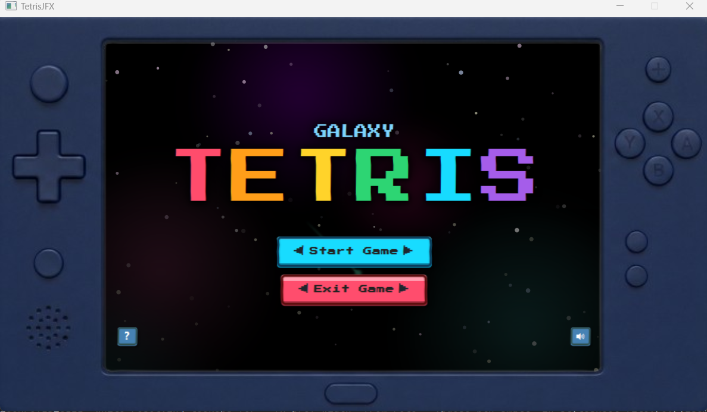

# COMP2042 – Software Maintenance
## Tetris Maintenance & Extension Coursework

**Student Name:** Jana Arab  
**Student ID:** 20595191  
**OWA:** hfyja3  
**GitHub Repository:** [https://github.com/JanaArab/CW2025](https://github.com/JanaArab/CW2025)

---

## Table of Contents

- [1.0 Compilation Instructions](#10-compilation-instructions)
  - [1.1 Prerequisites](#11-prerequisites)
  - [1.2 Building and Running](#12-building-and-running)
  - [1.3 IDE Setup](#13-ide-setup)
- [2.0 Overview](#20-overview)
- [3.0 Development Plan](#30-development-plan)
- [4.0 Refactoring](#40-refactoring)
  - [4.1 Package Reorganisation](#41-package-reorganisation)
  - [4.2 Code Cleanup and Bug Fixes](#42-code-cleanup-and-bug-fixes)
  - [4.3 SOLID Principles](#43-solid-principles)
  - [4.4 Design Patterns](#44-design-patterns)
- [5.0 Features](#50-features)
  - [5.1 Working Implemented Features](#51-working-implemented-features)
  - [5.2 Implemented but Not Fully Working](#52-implemented-but-not-fully-working)
  - [5.3 Not Implemented](#53-not-implemented)
- [6.0 Class Documentation](#60-class-documentation)
  - [6.1 New Java Classes](#61-new-java-classes)
  - [6.2 Modified Java Classes](#62-modified-java-classes)
- [7.0 Unexpected Challenges](#70-unexpected-challenges)
- [8.0 Testing](#80-testing)
  - [8.1 JUnit Testing Overview](#81-junit-testing-overview)
  - [8.2 Test Coverage by Package](#82-test-coverage-by-package)
  - [8.3 Running Tests](#83-running-tests)

---

## 1.0 Compilation Instructions

### 1.1 Prerequisites

| Requirement | Version |
|-------------|---------|
| Java Development Kit (JDK) | 23 or higher |
| Apache Maven | 3.8.0 or higher |
| JavaFX | 21.0.6 (managed by Maven) |
| Operating System | Windows, macOS, or Linux |

### 1.2 Building and Running

```bash
# Clone the repository
git clone [repository-url]
cd CW2025

# Clean and compile
mvn clean compile

# Run the application
mvn javafx:run

# Run tests
mvn test

# Build JAR package
mvn clean package
```

**Windows (Maven Wrapper):**
```cmd
mvnw.cmd javafx:run
```

### 1.3 IDE Setup

**IntelliJ IDEA:**
1. Open project folder as Maven project
2. Wait for dependencies to download
3. Add Maven run configuration with goal: `javafx:run`

**Eclipse:**
1. Import as existing Maven project
2. Run As > Maven Build with goal: `javafx:run`

---

## 2.0 Overview

This project maintains and extends a classic Tetris game implemented in JavaFX. The application follows the **Model-View-Controller (MVC)** architecture:

| Layer | Location | Components |
|-------|----------|------------|
| **Model** | `src/main/java/com/comp2042/tetris/model/` | Board, Bricks, Score, Levels, Events |
| **View** | `src/main/java/com/comp2042/tetris/view/` | BoardRenderer, Animators, FXML layouts |
| **Controller** | `src/main/java/com/comp2042/tetris/controller/` | GuiController, GameController, InputHandler |

**Primary Objectives:**
- Maintain the codebase by fixing bugs and improving code quality
- Extend with new features, levels, and visual effects
- Apply SOLID principles and design patterns

---

## 3.0 Development Plan

**Phase 1 - Familiarisation:**
Set up GitHub repository, ran the original game, and explored the codebase to understand its structure. Identified obvious bugs and code smells that needed fixing.

**Phase 2 - Learning:**
Studied SOLID principles and design patterns to understand how to properly refactor and improve the codebase architecture.

**Phase 3 - Initial Refactoring:**
Applied learned principles to reorganise packages, fix bugs, improve naming conventions, and separate concerns across classes.

**Phase 4 - Feature Implementation:**
Developed the galaxy theme with visual effects (stars, nebula, shooting stars). Added new gameplay features including multiple levels, sound system, and UI screens.

**Phase 5 - Final Refactoring:**
Revisited the codebase to further refine architecture, add documentation, and ensure consistency across all components.

---

## 4.0 Refactoring

### 4.1 Package Reorganisation

The codebase was restructured from a flat structure into a clear hierarchy under `src/main/java/com/comp2042/tetris/`:

```
tetris/
├── controller/
│   ├── command/      # Command pattern for input (GameCommand, MoveLeftCommand, etc.)
│   ├── core/         # Core controllers (GameController, GameFlowManager, InputHandler)
│   └── ui/           # UI controllers (GuiController, MenuController, SettingsController)
│       └── handlers/ # Event handlers (MenuEventHandler, SettingsEventHandler)
├── game/             # Game loop and timing (GameLoop, GameTimer, GameStateManager)
├── main/             # Entry point (Main, GameComponentBuilder)
├── model/
│   ├── board/        # Board logic (Board, SimpleBoard, GarbageMechanic)
│   ├── bricks/       # Brick types and generation (Brick, BrickGenerator, BrickRotator)
│   ├── data/         # Data transfer objects (ViewData)
│   ├── event/        # Event system (GameEventPublisher, GameEventListener)
│   ├── level/        # Level configs (GameLevel, Level1, Level2, Level3)
│   └── score/        # Scoring (Score, ScoreManager, ScorePolicy)
├── utils/            # Utilities (AudioManager, MatrixOperations, SafeMediaPlayer)
└── view/             # Rendering and effects (BoardRenderer, VisualEffectsManager, animators)
```

### 4.2 Code Cleanup and Bug Fixes

| Issue | Fix | Location |
|-------|-----|----------|
| Unused code | Removed dead code and unused methods | Various files |
| Score not displayed | Connected existing score logic to UI | `controller/ui/GuiController.java` |
| Pause not displayed | Enabled pause menu functionality | `controller/ui/GuiController.java` |
| Next brick not shown | Connected next brick preview to UI | `view/BoardRenderer.java` |
| Brick spawn position | Fixed where bricks fall from | `model/board/SimpleBoard.java` |
| Poor naming conventions | Renamed variables and methods for clarity | Various files |

### 4.3 SOLID Principles

#### 4.3.1 Single Responsibility Principle (SRP)
> *A class should have only one reason to change.*

The original `GuiController` was handling too many responsibilities. By extracting separate classes, each component became easier to maintain and test independently.

| Class | Responsibility | Location |
|-------|----------------|----------|
| `ScoreManager` | Score calculations and events | `model/score/ScoreManager.java` |
| `GameFlowManager` | Game state transitions | `controller/core/GameFlowManager.java` |
| `SoundManager` | Audio playback | `controller/ui/SoundManager.java` |
| `InputController` | Keyboard/mouse input | `controller/ui/InputController.java` |
| `BoardRenderer` | Visual rendering | `view/BoardRenderer.java` |

#### 4.3.2 Open/Closed Principle (OCP)
> *Open for extension, closed for modification.*

Using interfaces allowed me to add new levels and features without modifying existing working code. New levels simply implement the `GameLevel` interface.

| Interface | Purpose | Implementations | Location |
|-----------|---------|-----------------|----------|
| `GameLevel` | Define level behaviour | `ClassicLevel`, `Level1`, `Level2`, `Level3` | `model/level/` |
| `BrickGenerator` | Brick generation strategies | `RandomBrickGenerator` | `model/bricks/` |
| `ScorePolicy` | Scoring algorithms | `DefaultScorePolicy` | `model/score/` |
| `GameCommand` | Input commands | `MoveLeftCommand`, `RotateCommand`, etc. | `controller/command/` |

#### 4.3.3 Liskov Substitution Principle (LSP)
> *Subtypes must be substitutable for their base types.*

All brick types and levels are interchangeable. The game controller doesn't need to know which specific level or brick it's working with.

| Base Type | Substitutable Implementations | Location |
|-----------|------------------------------|----------|
| `Brick` | `JBrick`, `LBrick`, `OBrick`, `SBrick`, `TBrick`, `ZBrick` | `model/bricks/` |
| `GameLevel` | `ClassicLevel`, `Level1`, `Level2`, `Level3` | `model/level/` |
| `Board` | `SimpleBoard` | `model/board/` |

#### 4.3.4 Interface Segregation Principle (ISP)
> *Clients should not depend on interfaces they don't use.*

Interfaces were kept small and focused. For example, `GameEventPublisher` only handles publishing while `GameEventListener` only handles receiving.

| Interface | Methods | Location |
|-----------|---------|----------|
| `Board` | Only board operations | `model/board/Board.java` |
| `BrickGenerator` | `getBrick()`, `getNextBrick()`, `getNextBricks()` | `model/bricks/BrickGenerator.java` |
| `GameEventPublisher` | Only publishing methods | `model/event/GameEventPublisher.java` |
| `GameEventListener` | Only listening methods | `model/event/GameEventListener.java` |
| `GameCommand` | Single `execute()` method | `controller/command/GameCommand.java` |

#### 4.3.5 Dependency Inversion Principle (DIP)
> *Depend on abstractions, not concrete implementations.*

High-level modules depend on interfaces rather than concrete classes. This made testing easier and allowed swapping implementations.

| High-Level Class | Depends On (Abstraction) | Not On (Concrete) | Location |
|------------------|--------------------------|-------------------|----------|
| `GameController` | `Board` interface | `SimpleBoard` | `controller/core/GameController.java` |
| `GameController` | `GameEventPublisher` | `SimpleGameEventBus` | `controller/core/GameController.java` |
| `ScoreManager` | `ScorePolicy` interface | `DefaultScorePolicy` | `model/score/ScoreManager.java` |

### 4.4 Design Patterns

| Pattern | Implementation | Location | Purpose |
|---------|---------------|----------|---------|
| **Singleton** | `AudioManager` | `utils/AudioManager.java` | Single audio control point |
| **Singleton** | `GameEventBusProvider` | `model/event/GameEventBusProvider.java` | Global event bus access |
| **Factory** | `GameComponentBuilder` | `main/GameComponentBuilder.java` | Creates game components |
| **Factory** | `InputCommandFactory` | `controller/command/InputCommandFactory.java` | Creates command objects |
| **Command** | `GameCommand` + implementations | `controller/command/` | Decouples input from actions |
| **Observer** | `GameEventPublisher`/`Listener` | `model/event/` | Decouples model from UI |
| **Strategy** | `ScorePolicy`, `BrickBagPolicy` | `model/score/`, `model/bricks/` | Interchangeable algorithms |
| **Builder** | `GameComponentBuilder` | `main/GameComponentBuilder.java` | Fluent game initialisation |

---

## 5.0 Features

### 5.1 Working Implemented Features

The game was redesigned with a **Galaxy Tetris** theme, featuring a retro gameboy-style controller frame that surrounds the gameplay area. This gives the game a nostalgic arcade feel while maintaining modern visual effects.



#### Core Gameplay

| # | Feature | Description | Location |
|---|---------|-------------|----------|
| 1 | Classic Tetris | All 7 tetromino types | `model/board/SimpleBoard.java`, `model/bricks/*.java` |
| 2 | Ghost Brick | Shows landing position | `view/BoardRenderer.java` |
| 3 | Next Brick Preview | Shows upcoming bricks | `view/BoardRenderer.java` |
| 4 | Hard Drop | Instant drop to bottom | `controller/command/InstantDropCommand.java` |
| 5 | Score System | Points for drops/clears | `model/score/ScoreManager.java` |

#### Game Levels

| # | Feature | Description | Location |
|---|---------|-------------|----------|
| 6 | Level Selection | Classic, L1, L2, L3 | `controller/ui/LevelSelectionController.java` |
| 7 | Dynamic Speed (L1) | Speed increases with score | `model/level/Level1.java` |
| 8 | Rotation Limit (L2) | Max 4 rotations per brick | `model/level/Level2.java` |
| 9 | Challenge Mode (L3) | Garbage, flicker, inverted | `model/level/Level3.java` |

#### Audio & Visual Effects

| # | Feature | Description | Location |
|---|---------|-------------|----------|
| 10 | Sound Effects | Rotation, placement, UI | `utils/AudioManager.java` |
| 11 | Background Music | Multiple tracks | `utils/SafeMediaPlayer.java` |
| 12 | Volume Controls | Music/SFX sliders | `controller/ui/SoundManager.java` |
| 13 | Row Clear Animation | Fade and scale | `view/RowClearAnimator.java` |
| 14 | Pixel Stars | Twinkling background | `view/PixelStarAnimator.java` |
| 15 | Shooting Stars | Animated streaks | `view/ShootingStarAnimator.java` |
| 16 | Nebula Clouds | Cosmic background | `view/NebulaCloudAnimator.java` |
| 17 | Fireworks | Celebration effects | `view/FireworkAnimator.java` |
| 18 | Screen Flicker | L3 disruption | `view/VisualEffectsManager.java` |
| 19 | Intro Animation | TV static effect | `view/StaticScreenAnimator.java` |

#### UI Screens

| # | Feature | Location (Controller) | Location (FXML) |
|---|---------|----------------------|-----------------|
| 20 | Main Menu | `controller/ui/MainMenuController.java` | `resources/layout/MainMenu.fxml` |
| 21 | Pause Menu | `controller/ui/PauseMenuController.java` | `resources/layout/PauseMenu.fxml` |
| 22 | Game Over | `controller/ui/GameOverController.java` | `resources/layout/gameOverScreen.fxml` |
| 23 | Settings | `controller/ui/SettingsController.java` | `resources/layout/Settings.fxml` |
| 24 | Tutorial | `controller/ui/TutorialController.java` | `resources/layout/Tutorial.fxml` |
| 25 | Confirmation | `controller/ui/ConfirmationDialogController.java` | `resources/layout/ConfirmationDialog.fxml` |
| 26 | Level Hints | `controller/ui/GuiController.java` | N/A |
| 27 | Game Timer | `game/GameTimer.java` | N/A |

### 5.2 Implemented but Not Fully Working

| Feature | What Works | Issue | Location | Fix Attempted |
|---------|------------|-------|----------|---------------|
| Garbage Row Timing | Rows added in L3 | Inconsistent under load | `model/board/GarbageMechanic.java` | `System.nanoTime()` timing |
| Rotation Limit Display | Limit enforced | Popup flickers | `controller/ui/GuiController.java` | Animation timing adjustment |

### 5.3 Not Implemented

| Feature | Reason |
|---------|--------|
| Multiple Themes (Dark/Light) | Too complex and time consuming to implement properly |
| Touchpad Controller | Difficult to implement brick movement/rotation via touchpad; time constraints |
| Moving Picture Background | Caused game lag and looked poor; replaced with shooting stars, pixel stars, and nebula clouds as a better alternative |

---

## 6.0 Class Documentation

### 6.1 New Java Classes

#### Controller Package (`controller/`)

**Command Subpackage** (`controller/command/`):
- `GameCommand` - Interface for command pattern
- `CommandRegistry` / `DefaultCommandRegistry` - Command registration
- `InputCommandFactory` / `DefaultInputCommandFactory` - Command factory
- `MoveLeftCommand`, `MoveRightCommand`, `MoveDownCommand`, `RotateCommand`, `InstantDropCommand`

**Core Subpackage** (`controller/core/`):
- `IGameController` - Game controller interface
- `GameFlowManager` - State transitions and garbage
- `GameOverManager` - Game over handling
- `GameActionInvoker` - Command invocation
- `InputCommandRegistrar`, `InputEventListener`

**UI Subpackage** (`controller/ui/`):
- `IGuiController`, `GuiControllerDependencies`, `DefaultGuiControllerDependenciesFactory`
- `InputController` - Centralised input
- `SoundManager` - Audio management
- `MenuController`, `MainMenuController`, `PauseMenuController`, `GameOverController`
- `SettingsController`, `TutorialController`, `LevelSelectionController`, `ConfirmationDialogController`

**Handlers** (`controller/ui/handlers/`):
- `MenuEventHandler`, `SettingsEventHandler`, `TutorialEventHandler`, `LevelSelectionEventHandler`, `ConfirmationEventHandler`

#### Game Package (`game/`):
- `GameLoop` - Timeline-based game loop
- `GameTimer` - Play time tracking
- `GameStateManager` - State management
- `AnimationHandler` - Animation coordination

#### Main Package (`main/`):
- `GameComponentBuilder` - Component builder with fluent API

#### Model Package (`model/`)

| Subpackage | Classes |
|------------|---------|
| `board/` | `GarbageMechanic` |
| `bricks/` | `AbstractBrick`, `IBrick`, `BrickGenerator`, `RandomBrickGenerator`, `BrickRotator`, `BrickBagPolicy`, `ShuffleBagPolicy`, `RotationStrategy`, `StandardRotationStrategy`, `BrickType` |
| `data/` | `ViewData` |
| `event/` | `GameEventPublisher`, `SimpleGameEventBus`, `GameEventListener`, `GameEventBusProvider`, `GameStateSnapshot`, `MoveEvent`, `BrickPlacedEvent`, `ScoreChangeEvent`, `NextShapeInfo`, `EventSource`, `EventType` |
| `level/` | `GameLevel`, `ClassicLevel`, `DynamicLevel`, `Level1`, `Level2`, `Level3` |
| `score/` | `ScoreManager`, `ScorePolicy`, `DefaultScorePolicy`, `ScoreCalculator` |

#### Utils Package (`utils/`):
- `AudioManager`, `SafeMediaPlayer`, `MatrixOperations`, `ScoreThresholdDetector`, `Pure`

#### View Package (`view/`):
- `BoardRenderer`, `VisualEffectsManager`, `UIConstants`
- `OverlayPanel`, `NotificationPanel`, `NotificationAnimator`
- Animators: `RowClearAnimator`, `FireworkAnimator`, `PixelStarAnimator`, `PixelStarExplosion`, `ShootingStarAnimator`, `NebulaCloudAnimator`, `StaticScreenAnimator`, `DistortionAnimator`, `BackgroundAnimator`, `StarBackgroundManager`, `GameViewPresenter`

#### Test Harness (`testharness/`):
- `InputHandlerHarness`

### 6.2 Modified Java Classes

| Class | Location | Modification |
|-------|----------|--------------|
| `Main` | `main/Main.java` | Refactored to use `GameComponentBuilder` |
| `GuiController` | `controller/ui/GuiController.java` | Extracted `SoundManager`, `InputController`, `VisualEffectsManager` |
| `SimpleBoard` | `model/board/SimpleBoard.java` | Added level support, garbage rows, collision fixes |
| `BoardRenderer` | `view/BoardRenderer.java` | Added ghost brick, next queue, animations |
| `Score` | `model/score/Score.java` | Works with `ScoreManager` |
| `Brick` | `model/bricks/Brick.java` | Converted to interface |
| `JBrick`, `LBrick`, `OBrick`, `SBrick`, `TBrick`, `ZBrick` | `model/bricks/` | Extended `AbstractBrick` |
| `ClearRow` | `model/board/ClearRow.java` | Converted to record |
| `AudioManager` | `utils/AudioManager.java` | Volume control, lazy loading |
| `InputHandler` | `controller/core/InputHandler.java` | Command pattern integration |

---

## 7.0 Unexpected Challenges

**Game Layout**
- Problem: Fitting gameplay inside controller window without clashing with borders
- Solution: Careful UI positioning and size calculations
- Location: `view/BoardRenderer.java`, `resources/layout/gameLayout.fxml`

**Sound Merging**
- Problem: Multiple sounds playing simultaneously merged together and sounded bad
- Solution: Implemented proper audio management with sound queuing
- Location: `utils/AudioManager.java`

**Brick Rendering**
- Problem: Brick merging and rotation caused lag; container expanded/shrunk during play
- Solution: Optimised rendering logic and fixed container sizing
- Location: `view/BoardRenderer.java`, `model/board/SimpleBoard.java`

**Row Clear Effect**
- Problem: Animation removed lines visually but not from game logic
- Solution: Synchronised visual effect with actual board state update using callbacks
- Location: `view/RowClearAnimator.java`

**Animation Timing**
- Problem: Visual inconsistencies between animations and game state
- Solution: Implemented callbacks for proper sequencing
- Location: `view/RowClearAnimator.java`

**Refactoring**
- Problem: Large changes broke existing functionality
- Solution: Interface-first approach with gradual migration
- Location: Various

---

## 8.0 Testing
### 8.1 JUnit Testing Overview

Unit tests were written using **JUnit 5** to verify the correctness of refactored components and ensure new features work as expected. Tests follow the **Arrange-Act-Assert** pattern and focus on isolated unit testing.


Tests located in `src/test/java/com/comp2042/tetris/`:

### 8.2 Test Coverage by Package

| Package | Test Class | What It Tests |
|---------|------------|---------------|
| `controller/` | `GameControllerTest` | Game state transitions, brick spawning, game over detection |
| `controller/` | `GameFlowManagerTest` | Pause/resume, level transitions, garbage row scheduling |
| `controller/` | `InputHandlerTest` | Key mappings, command execution |
| `controller/` | `SoundManagerTest` | Volume controls, mute functionality |
| `controller/command/` | `GameCommandTest` | All command implementations (move, rotate, drop) |
| `model/board/` | `SimpleBoardTest` | Brick placement, collision detection, row clearing |
| `model/board/` | `GarbageMechanicTest` | Garbage row generation and insertion |
| `model/board/` | `ClearRowTest` | Row clearing logic verification |
| `model/board/` | `WallCollisionTest` | Wall boundary collision detection |
| `model/bricks/` | `RandomBrickGeneratorTest` | Brick bag randomisation |
| `model/bricks/` | `BrickRotatorTest` | Rotation matrix transformations |
| `model/bricks/` | `BrickTypesTest` | All 7 tetromino types validation |
| `model/bricks/` | `ShuffleBagPolicyTest` | 7-bag randomisation algorithm |
| `model/event/` | `SimpleGameEventBusTest` | Event publishing and subscription |
| `model/event/` | `GameStateSnapshotTest` | Game state capture and restore |
| `model/level/` | `GameLevelTest` | Level configurations (L1, L2, L3) |
| `model/score/` | `ScoreManagerTest` | Score calculation, high score tracking |
| `model/score/` | `DefaultScorePolicyTest` | Points per line, combo bonuses |
| `model/score/` | `ScoreCalculatorTest` | Score computation logic |
| `game/` | `AnimationHandlerTest` | Animation coordination and callbacks |
| `game/` | `GameStateManagerTest` | Game state management |
| `utils/` | `MatrixOperationsTest` | Matrix rotation, transposition |
| `view/` | `RowClearAnimatorTest` | Row clear animation timing |


### 8.3 Running Tests
```bash
mvn test                           # Run all tests
mvn test -Dtest=GameControllerTest # Run specific test
mvn test jacoco:report             # With coverage report
```

---
